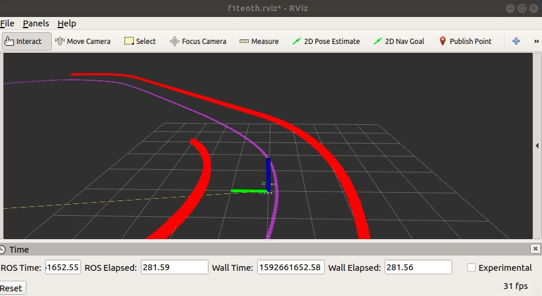

# Waypoint Recorder
Package for recording waypoint trajectory in the gazebo simulator.

## Requirements 
1. Python packages
```
pip2 install numpy==1.16.6 --user
pip2 install pandas==0.24.2 --user
pip2 install roslib==1.14.8 --user
```
2. ROS Melodic messages
```
sudo apt-get install ros-melodic-geometry-msgs
sudo apt-get install ros-melodic-visualization-msgs
sudo apt-get install ros-melodic-nav-msgs
```

## Explanation
### 1. Waypoint recorder (recorder.py)
Subscribe the current position of ego vehicle and save the position every specific distance.

You can change these parameters
- WPT_CSV_PATH : the path for saving your waypoint trajectory
- WPTS_GAP     : the gap distance between each waypoint (Waypoint trajectory resolution)

```
rosrun waypoint_recorder recorder.py
```

For manual control using your keyboard inputs, run this package

```
rosrun ackermann_drive_teleop keyop
```

### 2. Waypoint recorder (loader.py)
Publish the waypoint recorded.

For visualizing the waypoint, use rviz and add topic "/waypoint_markers". Purple markers are the waypoints you recorded.

You can change these parameters
- WPT_CSV_PATH : the path for your saved waypoint trajectory

```
rosrun waypoint_recorder loader.py
```

